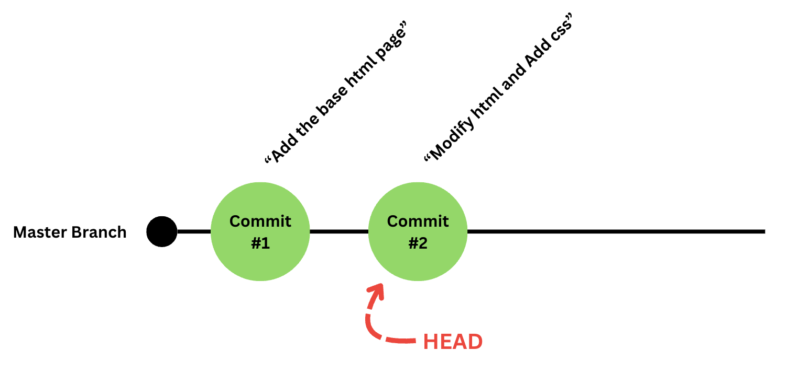
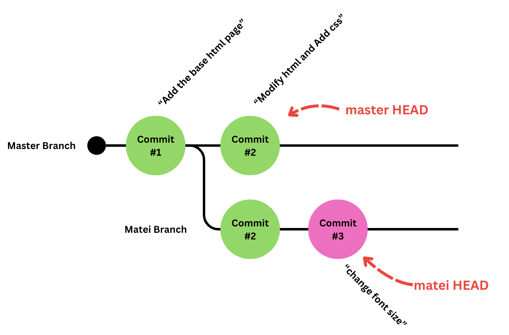

# Git
Git is a software project management and version control system. It is used to track changes in source code and collaborate with other developers.

Git is one of the essential tools for software developers and is commonly used in the IT industry.

In this course, we will explore how to use Git to collaborate and transfer our projects and code from one computer to another.

## Repositories & Commits

In essence, a project always starts from an empty project on your computer.

In that folder, we can create files. And each file is actually a list of lines. This list of lines is unlimited, because files can be as large as we want.

A project is the sum of its lines of code.

Git is a system that tracks the changes made in a folder. It sees a project as a folder to which lines are added and removed. These additions and removals are all grouped under a bundle of changes called a `commit`.

A commit is a group of changes made to the project. We can think of a project as a list of commits that are progressively applied to a starting point (an empty folder).

To create such a project, we would like to run the command in the terminal:

```bash
git init
```

This command will initialize a project (or as git calls it: a `repository`).

> 🤓 Under the hood, git will create an invisible folder called .git which will store all the project information and track all the changes.

Let's say we want to create a website. In a commit, we would like to add `index.html`.

```html
<!DOCTYPE html>
<html>
<head>
    <title>My Simple HTML Site</title>
</head>
<body>
    <h1>Welcome to My Simple HTML Site!</h1>
    <p>This is a basic HTML site with minimal content.</p>
</body>
</html>
```
When we create this file, git will percieve it as:

In file `index.html`, 10 lines were added at line 0.

Every change we make by creating or editing files is an untracked change. These changes have not been "officialized" by git, so we can modify everything to our heart's content.

However, when we are done with our work, we need to tell git to track the changes we have made.

To do this, we will write in the terminal:

```bash
git add index.html
```

This wil track all the changes made in `index.html`.

But if we had made a lot of changes in a lot of files and we want to track everything? Do we need to do that for each file?

NO. We can just write:

```bash
git add .
```

This will track all changes.

However, even if we track the changes, they are not official. To officialize the changes, we need to make a `commit`.

We will do this with the commit command:

```bash
git commit -m "Add the base html page."
```

The thing in the quotes is the commit message. The commmit message must explain briefly what the commit contains.

After the changes have been commited, they are forever added to the timeline of changes to the project.

Now, each subsequent change we will make will be counted from the last commit.

Let's say we want to change the text in our html, like so:

```html
<!-- index.html-->
<!DOCTYPE html>
<html>
<head>
    <title>My Simple HTML Site</title>
</head>
<body>
    <h1>Welcome to My Simple HTML Site!</h1>
--    <p>This is a basic HTML site with minimal content.</p>
++    <p>Some stuff</p>
</body>
</html>
```

And also add a stylesheet:

```css
/* style.css */
p {
    font-size: 24px;
}
```

Git will percieve this change as:

1. In index.html:
   1. Remove line 7.
   2. Add 1 line at line 7.
2. In style.css
   1. Add the 3 lines at line 0.

Then, when we would like to officialize this change, we would write again:

```bash
git add .
git commit -m "modify html add css"
```

> 💡 Commit messages should be written in present tense: Make changes, create files etc...

Now, our official state of the project is the one from the last commit. The last commit created by us is called the `HEAD` of our project. Is the latest version of the project we have.

The timeline of changes we made from the start of the project and until the `HEAD` commit is called a `branch`. Each project starts from the `main` branch, or `master` branch.

> 🤓 The official git initial branch is called `master` however github wanted to make a statement on slavery at one point and they changed their starter branches to `main`. This will become relevant later.

Our project currently looks like this:



## Why is the system good?

The cool part is that we could think of the project itself as a list of changes made to a base state of the project. 

So, if we know all the changes we made to the project, and the base state (the empty folder) we can just apply the modifications from every commit to get to our current version. We can also inspect previous versions of the project, if for example the latest version doesn't work and we need to build the project and show it to our friends.

And basically, every commit is revertable, we can go back to the state that the project was last week, or last month by applying the changes in reverse until we reach that commit.

## Branches and Parallel Timelines.

Ok. So, up to now, git has been a cool system to manage the versions of your project. However we claimed that git lets you collaborate and share code with your colleagues.

Git is an essential tool because it allows programmers to work in parallel. By "work in parallel" we mean making changes to the base state of the project at the same time. However, there can not be two people that modify the same branch at the same time.

Let's say another programmer named Matei joins your project. He would like to take all your changes and make his own contributions, but doesn't want to interfere with your commits.

What he can do is create another branch, using the comand:

```bash
git branch matei
```

This will create a new timeline of changes, whose base commit is the HEAD of the previously selected branch (in our case our `master branch`). The branch will be called "matei".

Now let's say that Matei would like to modify the font-size of the paragraphs on your website. He will write the following:

```css
/* style.css */
p {
--    font-size: 24px;
++    font-size: 32px;
}
```

Similary, Matei will add and commit these changes under a new commit.

```bash
git add .
git commit -m "change font size"
```

The project will now look like this:



Let's say that Matei leaves from the computer, but still wants to make more changes later.

Now we return to the computer and want to make our own changes, however, we want the following:

- We don't want to have Matei's changes on our work.
- We don't want to discard or modify what he changed either.

So what we can do is to return to the `master` branch. To select a different branch from the current one, we simply run:

```bash
git checkout master
```

What this does is it reverts the state of the project to the `HEAD` of the selected branch, in this case `master HEAD`.

Now, we want to add styling for the h1 elements:

```css
/* style.css */
p {
    font-size: 24px;
}
++h1 {
++    color: yellow;
++    font-weight: bold;
++}
```

We are happy with our work, so we commit. As always:

```bash
git add .
git commit -m "add heading"
```

So we leave our computer again, then Matei comes back and wants to add his own styling to the h1 element. So he will checkout his own branch, make the changes and commit his changes.

Adds:
```css
/* style.css */
p {
    font-size: 24px;
}
++h1 {
++    color: blue;
++    font-style: italic;
++}
```

```bash
git add .
git commit -m "add blue heading"
```

The current state of the git repository is the following:


## Merging branches togheter.

Now that we've all made our changes, we need to bring them all togheter.

To bring all changes togheter, we need to select a branch *into* which we want to make our merge using checkout. Then we want to use the `merge` command and give as an argument the branch whose changes we want to merge into ours:

```bash
git checkout master
git merge matei
```

However, we will have some issues, as both we and Matei have added 4 lines at line 4 in the `style.css` file.

When two people have modified a file in the same place and we want to merge our changes togheter, we will get what is called a conflict.