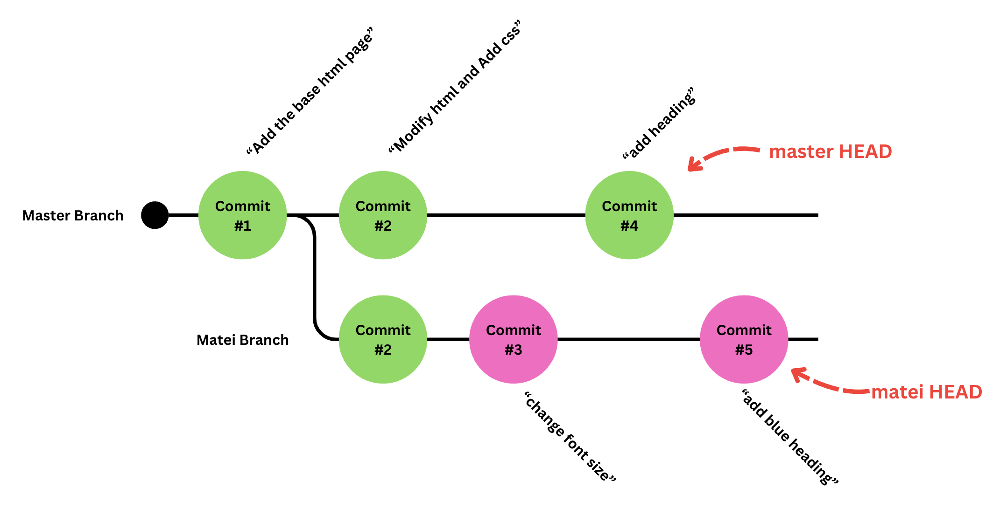
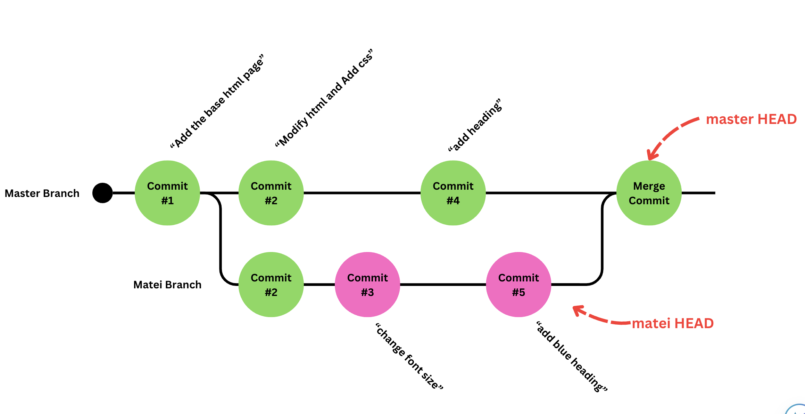
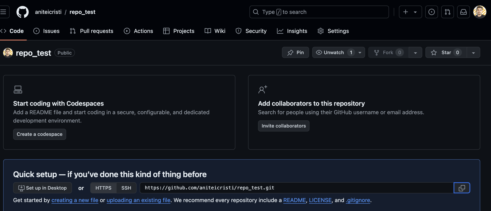

# Git
Git is a software project management and version control system. It is used to track changes in source code and collaborate with other developers.

Git is one of the essential tools for software developers and is commonly used in the IT industry.

In this course, we will explore how to use Git to collaborate and transfer our projects and code from one computer to another.

## Repositories & Commits

In essence, a project always starts from an empty project on your computer.

In that folder, we can create files. And each file is actually a list of lines. This list of lines is unlimited, because files can be as large as we want.

A project is the sum of its lines of code.

Git is a system that tracks the changes made in a folder. It sees a project as a folder to which lines are added and removed. These additions and removals are all grouped under a bundle of changes called a `commit`.

A commit is a group of changes made to the project. We can think of a project as a list of commits that are progressively applied to a starting point (an empty folder).

To create such a project, we would like to run the command in the terminal:

```bash
git init
```

This command will initialize a project (or as git calls it: a `repository`).

> 🤓 Under the hood, git will create an invisible folder called .git which will store all the project information and track all the changes.

Let's say we want to create a website. In a commit, we would like to add `index.html`.

```html
<!DOCTYPE html>
<html>
<head>
    <title>My Simple HTML Site</title>
</head>
<body>
    <h1>Welcome to My Simple HTML Site!</h1>
    <p>This is a basic HTML site with minimal content.</p>
</body>
</html>
```
When we create this file, git will percieve it as:

In file `index.html`, 10 lines were added at line 0.

Every change we make by creating or editing files is an untracked change. These changes have not been "officialized" by git, so we can modify everything to our heart's content.

However, when we are done with our work, we need to tell git to track the changes we have made.

To do this, we will write in the terminal:

```bash
git add index.html
```

This wil track all the changes made in `index.html`.

But if we had made a lot of changes in a lot of files and we want to track everything? Do we need to do that for each file?

NO. We can just write:

```bash
git add .
```

This will track all changes.

However, even if we track the changes, they are not official. To officialize the changes, we need to make a `commit`.

We will do this with the commit command:

```bash
git commit -m "Add the base html page."
```

The thing in the quotes is the commit message. The commmit message must explain briefly what the commit contains.

After the changes have been commited, they are forever added to the timeline of changes to the project.

Now, each subsequent change we will make will be counted from the last commit.

Let's say we want to change the text in our html, like so:

```html
<!-- index.html-->
<!DOCTYPE html>
<html>
<head>
    <title>My Simple HTML Site</title>
</head>
<body>
    <h1>Welcome to My Simple HTML Site!</h1>
--    <p>This is a basic HTML site with minimal content.</p>
++    <p>Some stuff</p>
</body>
</html>
```

And also add a stylesheet:

```css
/* style.css */
p {
    font-size: 24px;
}
```

Git will percieve this change as:

1. In index.html:
   1. Remove line 7.
   2. Add 1 line at line 7.
2. In style.css
   1. Add the 3 lines at line 0.

Then, when we would like to officialize this change, we would write again:

```bash
git add .
git commit -m "modify html add css"
```

> 💡 Commit messages should be written in present tense: Make changes, create files etc...

> ❓ What do you think happens if you edit a file *after* committing it, but you forget to run `git add` again before your next commit? Will the change be saved?

Now, our official state of the project is the one from the last commit. The last commit created by us is called the `HEAD` of our project — the latest version we have.

The timeline of changes from the start of the project until the `HEAD` commit is called a `branch`. Each project starts from the `main` branch.

> 🤓 The `master` branch was the default branch in git. In 2020, the default was changed to `main`. You may notice the diagrams still say master — both names refer to the same concept.

Our project currently looks like this:


Since git tracks every change as a commit, you can always go back to any previous state — last week, last month — by reversing commits one by one.

> 💡 Commit often, in small logical chunks. A commit that bundles 10 unrelated changes is much harder to revert cleanly than 10 focused commits.

## Branches and Parallel Timelines.

Ok. So, up to now, git has been a cool system to manage the versions of your project. However we claimed that git lets you collaborate and share code with your colleagues.

Git is an essential tool because it allows programmers to work in parallel. By "work in parallel" we mean making changes to the base state of the project at the same time. However, there can not be two people that modify the same branch at the same time.

Let's say another programmer named Matei joins your project. He would like to take all your changes and make his own contributions, but doesn't want to interfere with your commits.

What he can do is create another branch, using the comand:

```bash
git branch matei
```

Then, we will select our branch with the `checkout` command:

```bash
git checkout matei
```

Now, all commands will apply to the `matei` branch. This creates a new timeline of changes whose base commit is the HEAD of the previously selected branch.

> 🔧 **Short Practice (5 min):** Create a branch with your own name using `git branch`, then switch to it with `git checkout`. Make a small change to a file and commit it. Run `git checkout main` afterwards — notice that your change "disappears" from view, because it only exists on your branch.

Now let's say that Matei would like to modify the font-size of the paragraphs on your website. He will write the following:

```css
/* style.css */
p {
--    font-size: 24px;
++    font-size: 32px;
}
```

Similary, Matei will add and commit these changes under a new commit.

```bash
git add .
git commit -m "change font size"
```

The project will now look like this:


Let's say that Matei leaves from the computer, but still wants to make more changes later.

Now we return to the computer and want to make our own changes, however, we want the following:

- We don't want to have Matei's changes on our work.
- We don't want to discard or modify what he changed either.

So what we can do is to return to the `main` branch. To select a different branch from the current one, we simply run:

```bash
git checkout main
```

What this does is it reverts the state of the project to the `HEAD` of the selected branch, in this case `main HEAD`.

Now, we want to add styling for the h1 elements:

```css
/* style.css */
p {
    font-size: 24px;
}
++h1 {
++    color: yellow;
++    font-weight: bold;
++}
```

We are happy with our work, so we commit. As always:

```bash
git add .
git commit -m "add heading"
```

So we leave our computer again, then Matei comes back and wants to add his own styling to the h1 element. So he will checkout his own branch, make the changes and commit his changes.

Adds:
```css
/* style.css */
p {
    font-size: 24px;
}
++h1 {
++    color: blue;
++    font-style: italic;
++}
```

```bash
git add .
git commit -m "add blue heading"
```

The current state of the git repository is the following:




## Merging branches togheter.

Now that we've all made our changes, we need to bring them all togheter.

To bring all changes togheter, we need to select a branch *into* which we want to make our merge using checkout. Then we want to use the `merge` command and give as an argument the branch whose changes we want to merge into ours:

```bash
git checkout main
git merge matei
```

However, we will have some issues, as both we and Matei have added 4 lines at line 4 in the `style.css` file.

When two people have modified a file in the same place and we want to merge our changes togheter, we will get what is called a `merge conflict`.

> 💡 A merge conflict is not an error or a sign you did something wrong — it's git's way of saying "I don't know which of these two changes you want, you decide." It happens to every developer, all the time.

When we have two lines which conflict, then they will be marked with certain symbols that promt you to choose one or both implementations to keep, or combine the changes togheter. It will look something like this:
```css
/* style.css */
p {
    font-size: 24px;
}
<<<<<< HEAD
h1 {
    color: blue;
    font-style: italic;
}
=======
h1 {
    color: yellow;
    font-weight: bold;
}
>>>>>> matei
```

Here we can look at both the changes and pick the one we want to eventually keep. Normally, you just pull your coleague and look at these togheter, or if you know what to do, you can just apply the changes yourself. In our case, we want to keep the color blue and font-style italic.

```css
/* style.css */
p {
    font-size: 24px;
}
h1 {
    color: yellow;
    font-style: italic;
}
```

The merge will combine all changes and after all conflicts are resolved, we can just add everything and create a commit (it will be a special merge commit).

```bash
git add .
git commit -m "merge commit"
```

Now, the timeline of our project will look something like this:



Now both of our changes and Matei's changes will be integrated into the main branch.

> ❓ Why do you think it's a bad idea to just pick "my version" every time you hit a merge conflict, without reading your teammate's change first?

## Remote repositories

Ok, ok, but in the previous example both Matei and us were still dependent on working on the same computer. This is impractical if we are not in the same room, and would like to work at the same time on the project.

This is where Github comes in.

> ❓ Many beginners think "Git" and "GitHub" are the same thing. What do you think the difference is?

Git is the program that runs on your machine and tracks changes. GitHub is a platform for hosting those repositories remotely so others can access them. Alternatives exist — GitLab, Bitbucket — but GitHub is the most widely used.

First, we would need to go to github and to create an empty repository. Once a repository is created, we can copy the link given to us, in our case `https://github.com/aniteicristi/repo_test.git`.



With this link, we need to run a command on our machine to connect our local repository to the remote repository.

```bash
git remote add origin https://github.com/aniteicristi/repo_test.git
```

This will add the repository created on github as a remote to our current repository.

Then we would run the following comand:
```bash
git branch -M main
```

What this command does is it renames our current branch to main, in order to match the main branch from github.

Then we would do what is called a `push` using this command:

```bash
git push -u origin main
```

The push command sends all local commits to the remote. The `-u` flag sets origin as the default, so from then on a plain `git push` is enough.

Now all of our work is backed up on GitHub and visible on the repository page.

## Clone, Push & Pull

Now that our repo is on github, we can take that previous url and provide it to our friend Matei.

Matei is now at his computer. He would like to copy the project to his device too. In order to copy an existing repository to your device, you need to use the clone command:

```bash
git clone https://github.com/aniteicristi/repo_test.git
```

If matei runs that in a terminal, he will notice a new folder created with the title `repo_test`. This folder will contain our whole project. Now matei can add his own modifications from his computer.

Let's say that Matei wants to add another change. After he is done, he will use the calssic trio:

```bash
git add .
git commit -m "message"
git push
```

And the main branch of the remote repository will have his updates.

Now, we would like to work on the project too, but we cannot modify our project before we get the latest changes from matei, or else we will have some problems.

In order to get the latest changes from the remote, we will use the `pull` command.

```bash
git pull
```

This will update our local copy of the branch and we can begin to make changes. When we are done, the classic trio pushes everything back up.

> 🔧 **Short Practice (5 min):** Pair up. One of you pushes a small change to the shared repo. The other clones the repo (or pulls, if already cloned), confirms the change is there, then makes their own change and pushes it back.

To work truly in parallel, each developer keeps their own branch. When changes are pushed, the branch is also created on GitHub. Use `git fetch --all` to check for updates on all branches without modifying your local files.

> 💡 `git fetch` only tells you what changed on the remote — it does **not** update your working folder. `git pull` is shorthand for `git fetch` + `git merge`.

## Pull Requests

Pull requests are a form of managed merging. normally, we would like to never modify the main branch locally. (in other words: we should never merge from main in our console).

Instead, we should always merge into our local branch from main. This will introduce all changes merged into main before to our branch. With this merge done, we simply commit and push them to the origin branch, and from github we create a `pull request` which basically says: "ok, I want to merge my changes into the main branch."

This pull request can be approved by a supervisor, or the supervisor can leave comments on your work and ask for changes. When he approves the `pull request` then the changes are introduced to the main branch.

> ❓ Why might a team prefer reviewing changes through a pull request instead of letting everyone merge straight into `main` whenever they want?