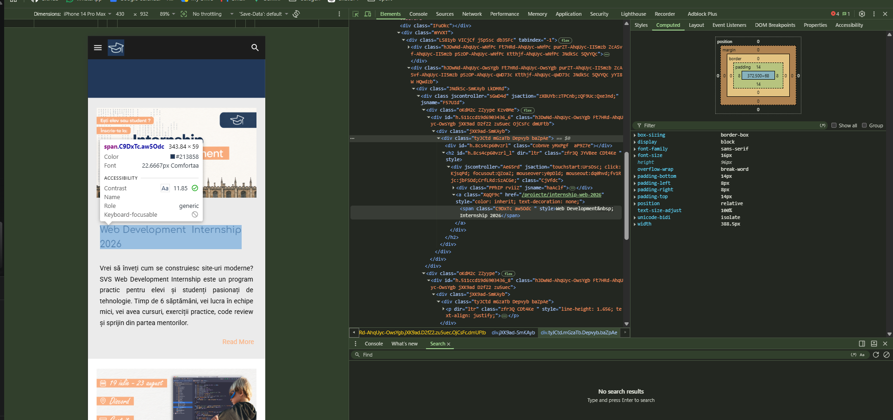

# CSS Basics

CSS (Cascading Style Sheets) is a stylesheet language used to describe the presentation of an HTML document. It controls the layout, colors, fonts, and overall appearance of a website.

## Adding CSS to HTML

<div style="float: right;">~15 minutes</div>

You can add CSS to HTML in three ways: Inline, Internal, and External. (Yes, CSS is flexible—like yoga for your website!)

### 1. Inline CSS

Add styles directly to HTML elements using the `style` attribute. (Great for quick fixes, but not recommended for big projects—unless you enjoy chaos!)

```html
<h1 style="color: blue; font-size: 24px;">This is a Heading</h1>
```

### 2. Internal CSS

Include CSS within the `<style>` tag in the `<head>` section of the HTML document.

```html
<!DOCTYPE html>
<html lang="en">
  <head>
    <meta charset="UTF-8" />
    <meta name="viewport" content="width=device-width, initial-scale=1.0" />
    <title>Page Title</title>
    <style>
      body {
        background-color: #f4f4f4;
      }
      h1 {
        color: blue;
        font-size: 24px;
      }
    </style>
  </head>
  <body>
    <h1>This is a Heading</h1>
    <p>This is a paragraph.</p>
  </body>
</html>
```

### 3. External CSS

Link to an external CSS file using the `<link>` tag. (The professional way! Keeps your styles neat and reusable.)

#### HTML:

```html
<!DOCTYPE html>
<html lang="en">
  <head>
    <meta charset="UTF-8" />
    <meta name="viewport" content="width=device-width, initial-scale=1.0" />
    <title>Page Title</title>
    <link rel="stylesheet" href="styles.css" />
  </head>
  <body>
    <h1>This is a Heading</h1>
    <p>This is a paragraph.</p>
  </body>
</html>
```

#### External CSS File (styles.css):

```css
body {
  background-color: #f4f4f4;
}
h1 {
  color: blue;
  font-size: 24px;
}
```

> 🔧 **Short Practice — Which style wins?**
>
> Create a page with an `<h1>`. Set its color to `red` in an external CSS file, then override it to `green` in a `<style>` block, then override it again to `blue` with an inline style.
>
> Open the page — what color is the heading? Now remove the inline style. What color is it now? Remove the `<style>` block. What color now?

> 💡 **Hint:** CSS has a priority order called **specificity**. When the same element is styled in multiple places, the browser picks the most "specific" one. Inline styles beat `<style>` blocks, which beat external files — think of it as closest-to-the-element wins. This priority order is what "Cascading" means in CSS.

## CSS Selectors

<div style="float: right;">~15 minutes</div>

Selectors tell the browser which HTML elements to style. The three most common are **element**, **class**, and **ID** selectors.

### Element Selector

Targets **every** element of that tag type on the page.

```css
p {
  color: red;
}
```

### Class Selector

Targets elements that have a matching `class` attribute. A class can be reused on as many elements as you like.

```css
.highlight {
  color: green;
}
```

```html
<p class="highlight">This will be green.</p>
<p>This won't — no class.</p>
```

### ID Selector

Targets a **single** element by its `id`. Each ID must be unique on the page.

```css
#title {
  color: blue;
}
```

```html
<h1 id="title">This will be blue.</h1>
```

### Seeing them all together

```html
<!DOCTYPE html>
<html lang="en">
  <head>
    <style>
      p {
        color: red;
      }
      .highlight {
        color: green;
      }
      #title {
        color: blue;
      }
    </style>
  </head>
  <body>
    <h1 id="title">Blue heading — matched by ID</h1>
    <p>Red paragraph — matched by element selector.</p>
    <p class="highlight">Green paragraph — matched by class.</p>
    <p>Also red — the element selector applies here too.</p>
  </body>
</html>
```

> 🔧 **Short Practice — Selectors**
>
> Create a list of 5 `<li>` items. Style all of them gray using an element selector. Then add a class `important` to two items and make those red. Finally, give one item the ID `featured` and make it bold and underlined.

> 💡 **Hint:** You can combine selectors on the same element — an `<li>` can have both a class and an ID at the same time. The most specific selector wins when styles conflict (remember the cascade!).

## Styling Text

<div style="float: right;">~10 minutes</div>

CSS provides various properties to style text, allowing you to change its appearance and improve readability. (Because nobody likes boring text!)

### Common Text Properties

- **Color** : Sets the text color.

- **Font Family** : Specifies the font of the text.

- **Font Size** : Defines the size of the text.

- **Font Weight** : Controls the thickness of the text.

- **Text Align** : Aligns the text within its container.

- **Text Decoration** : Adds decoration to text, such as underline, overline, or line-through.

### Example

```html
<!DOCTYPE html>
<html lang="en">
  <head>
    <meta charset="UTF-8" />
    <meta name="viewport" content="width=device-width, initial-scale=1.0" />
    <title>Styling Text Example</title>
    <style>
      h1 {
        color: darkred;
        font-family: "Georgia", serif;
        font-size: 32px;
        font-weight: bold;
        text-align: center;
      }

      p {
        color: darkslategray;
        font-family: "Arial", sans-serif;
        font-size: 16px;
        text-align: justify;
        text-decoration: underline dotted red;
      }
    </style>
  </head>
  <body>
    <h1>This is a Heading</h1>
    <p>
      This is a paragraph demonstrating various text styling properties using
      CSS. The text is justified, and its color, font family, and size have been
      customized.
    </p>
  </body>
</html>
```

> ❓ Look at this page — how many heading levels is it using? Can you spot an `<h1>`, `<h2>`, `<h3>`? How do they help you navigate the content?

> 💡 Most pages use 2–3 heading levels at most. Every extra size you add competes for attention — too many and the hierarchy collapses, leaving the reader unsure what to read first.

> ❓ Why do you think most websites use a different font for headings than for body text — what does mixing fonts achieve?

## CSS Box Model

<div style="float: right;">~20 minutes</div>

The CSS box model shows how an element's size is built from four parts:

- `Content`: the area for children, ex: text or images (`width` + `height`).
- `Padding`: space inside the border.
- `Border`: the line around the box.
- `Margin`: the space outside the box.


### Example

```html
<div class="box">This is a box.</div>
```

```css
.box {
  width: 100px;
  height: 200px;
  padding: 20px;
  border: 5px solid black;
  margin: 10px;
  background-color: lightblue;
}
```

**Total size = content + padding + border + margin:**

- `width`: 100 + 40 + 10 + 20 = 170px
- `height`: 200 + 40 + 10 + 20 = 270px

> 🔧 **Short Practice — Box model sizing**
>
> Before moving on, open your browser devtools and try this:
>
> 1. Create a `<div>` with `width: 100px`, `padding: 20px`, and `border: 5px solid black`.
> 2. Inspect it in devtools — what is the actual rendered width?
> 3. Now add `box-sizing: border-box` to the same element. What changed?

> 💡 By default CSS adds padding and border on top of the width you set. `box-sizing: border-box` makes the width include them — most developers add it globally to avoid surprises.

## Using DevTools

<div style="float: right;">~15 minutes</div>

Every browser ships with built-in developer tools that let you see exactly how your CSS is being applied — no guessing required.

1. **Right-click** any element on a page and choose **Inspect** (or press `F12` / `Ctrl+Shift+I`).
2. Click the **device toolbar** icon (or press `Ctrl+Shift+M`) to switch into mobile view first — since we build **mobile first**, this is how you'll spend most of your time in DevTools. Pick a specific device (iPhone, Pixel, etc.) from the dropdown, or drag the viewport edges to test custom widths.
3. The **Elements** panel shows the page's HTML — click a tag to select it.
4. The **Styles** panel shows every CSS rule applied to the selected element, including which ones are crossed out (overridden by the cascade). Changes here — and your media queries — update live as you resize the mobile viewport.
5. Scroll down in the Styles panel to find the **box model diagram** — it shows the live content, padding, border, and margin values for the selected element.



> 🔧 **Short Practice — Live editing**
>
> Open DevTools on [svs.ong](https://www.svs.ong). Change to mobile view. Select a heading or paragraph, then in the Styles panel try changing its `color` or `font-size`. Watch the page update instantly.
>
> Nothing you change here is saved — refresh the page and it's back to normal. This makes DevTools a safe place to experiment before touching your actual CSS file.

> 💡 DevTools is the single most useful tool for learning CSS. When a style isn't doing what you expect, inspecting the element usually shows you why — a more specific selector elsewhere, a typo in a property name, or a value being overridden.

> 💡 The device toolbar simulates screen size and touch input, but it doesn't run on real mobile hardware. Always do a final check on an actual phone before calling a page done.

---
