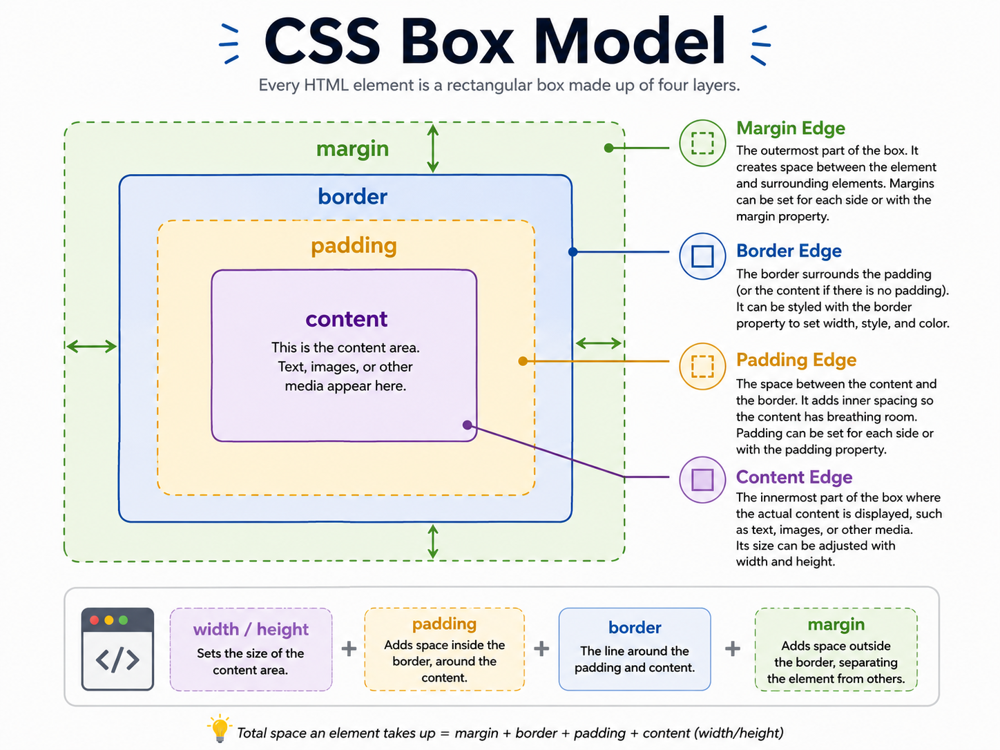

# CSS Basics

CSS (Cascading Style Sheets) is a stylesheet language used to describe the presentation of an HTML document. It controls the layout, colors, fonts, and overall appearance of a website.

## Adding CSS to HTML

<div style="float: right;">~10 minutes</div>

You can add CSS to HTML in three ways: Inline, Internal, and External. (Yes, CSS is flexible—like yoga for your website!)

### 1. Inline CSS

Add styles directly to HTML elements using the `style` attribute. (Great for quick fixes, but not recommended for big projects—unless you enjoy chaos!)

```html
<h1 style="color: blue; font-size: 24px;">This is a Heading</h1>
```

### 2. Internal CSS

Include CSS within the `<style>` tag in the `<head>` section of the HTML document.

```html
<!DOCTYPE html>
<html lang="en">
  <head>
    <meta charset="UTF-8" />
    <meta name="viewport" content="width=device-width, initial-scale=1.0" />
    <title>Page Title</title>
    <style>
      body {
        background-color: #f4f4f4;
      }
      h1 {
        color: blue;
        font-size: 24px;
      }
    </style>
  </head>
  <body>
    <h1>This is a Heading</h1>
    <p>This is a paragraph.</p>
  </body>
</html>
```

### 3. External CSS

Link to an external CSS file using the `<link>` tag. (The professional way! Keeps your styles neat and reusable.)

#### HTML:

```html
<!DOCTYPE html>
<html lang="en">
  <head>
    <meta charset="UTF-8" />
    <meta name="viewport" content="width=device-width, initial-scale=1.0" />
    <title>Page Title</title>
    <link rel="stylesheet" href="styles.css" />
  </head>
  <body>
    <h1>This is a Heading</h1>
    <p>This is a paragraph.</p>
  </body>
</html>
```

#### External CSS File (styles.css):

```css
body {
  background-color: #f4f4f4;
}
h1 {
  color: blue;
  font-size: 24px;
}
```

## CSS Selectors

Selectors are used to target HTML elements to apply styles. (Think of them as the matchmakers of the web—pairing style with substance!)

### Common Selectors

- **Element Selector** : Targets elements by their tag name.

#### CSS:

```css
p {
  color: red;
}
```

#### HTML:

```html
<p>This paragraph will be red.</p>
<p>So will this one.</p>
```

- **Class Selector** : Targets elements by their class attribute.

#### CSS:

```css
.my-class {
  color: green;
}
```

#### HTML:

```html
<p class="my-class">This paragraph will be green.</p>
<p>This paragraph will not be green.</p>
```

- **ID Selector** : Targets a single element by its ID attribute.

#### CSS:

```css
#my-id {
  color: blue;
}
```

#### HTML:

```html
<p id="my-id">This paragraph will be blue.</p>
<p>This paragraph will not be blue.</p>
```

---


## Styling Text

CSS provides various properties to style text, allowing you to change its appearance and improve readability. (Because nobody likes boring text!)

### Common Text Properties

- **Color** : Sets the text color.

```css
p {
  color: navy;
}
```

- **Font Family** : Specifies the font of the text.

```css
p {
  font-family: Arial, sans-serif;
}
```

- **Font Size** : Defines the size of the text.

```css
p {
  font-size: 16px;
}
```

- **Font Weight** : Controls the thickness of the text.

```css
p {
  font-weight: bold;
}
```

- **Text Align** : Aligns the text within its container.

```css
p {
  text-align: center;
}
```

- **Text Decoration** : Adds decoration to text, such as underline, overline, or line-through.

```css
p {
  text-decoration: underline;
}
```

### Example

```html
<!DOCTYPE html>
<html lang="en">
  <head>
    <meta charset="UTF-8" />
    <meta name="viewport" content="width=device-width, initial-scale=1.0" />
    <title>Styling Text Example</title>
    <style>
      h1 {
        color: darkred;
        font-family: "Georgia", serif;
        font-size: 32px;
        font-weight: bold;
        text-align: center;
      }

      p {
        color: darkslategray;
        font-family: "Arial", sans-serif;
        font-size: 16px;
        text-align: justify;
        text-decoration: none;
      }
    </style>
  </head>
  <body>
    <h1>This is a Heading</h1>
    <p>
      This is a paragraph demonstrating various text styling properties using
      CSS. The text is justified, and its color, font family, and size have been
      customized.
    </p>
  </body>
</html>
```

> "CSS: Making the web fabulous, one selector at a time!"

## CSS Box Model

**_Time: 20 min_**

The CSS box model shows how an element's size is built from four parts:

- `Content`: the area for children, ex: text or images (`width` + `height`).
- `Padding`: space inside the border.
- `Border`: the line around the box.
- `Margin`: the space outside the box.



### Example

```html
<div class="box">This is a box.</div>
```

```css
.box {
  width: 100px;
  height: 200px;
  padding: 20px;
  border: 5px solid black;
  margin: 10px;
  background-color: lightblue;
}
```

**Total size = content + padding + border + margin:**

- `width`: 100 + 40 + 10 + 20 = 170px
- `height`: 200 + 40 + 10 + 20 = 270px

> 🔧 **Short Practice — Box model sizing**
>
> Before moving on, open your browser devtools and try this:
>
> 1. Create a `<div>` with `width: 100px`, `padding: 20px`, and `border: 5px solid black`.
> 2. Inspect it in devtools — what is the actual rendered width?
> 3. Now add `box-sizing: border-box` to the same element. What changed?

> 💡 By default CSS adds padding and border on top of the width you set. `box-sizing: border-box` makes the width include them — most developers add it globally to avoid surprises.

---
