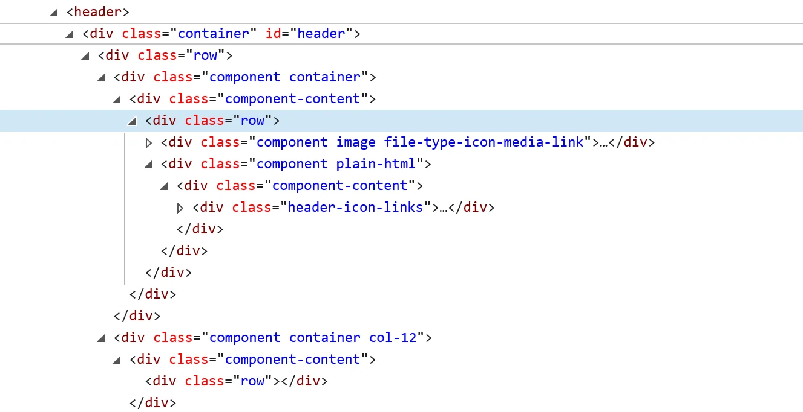

# Introduction to HTML

<div style="float: right;">~30 minutes</div>

HTML (Hypertext Markup Language) is the standard markup language used to create web pages. It provides the basic structure of sites, which is then enhanced and modified by other technologies like CSS and JavaScript.

## HTML Structure

Every HTML document begins with a doctype declaration and contains at least two main parts: the head and the body.

```html
<!DOCTYPE html>
<html lang="en">
  <head>
    <meta charset="UTF-8" />
    <meta name="viewport" content="width=device-width, initial-scale=1.0" />
    <title>Page Title</title>
  </head>
  <body>
    <h1>This is a Heading</h1>
    <p>This is a paragraph.</p>
    <!-- Warning: May contain traces of awesome! -->
  </body>
</html>
```

Here's a brief explanation of the HTML structure shown:

- `<!DOCTYPE html>`: Declares the document type and HTML version (HTML5). (Not to be confused with shouting at your computer!)

- `<html lang="en">`: The root element of the page, with an attribute specifying the content is in English. (Sadly, it doesn't translate your jokes.)

- `<head>`: Contains important metadata like:
  - `<meta charset="UTF-8">`: Sets character encoding to UTF-8. (So your emojis don’t turn into mysterious squares! 😎)

  - `<meta name="viewport" content="width=device-width, initial-scale=1.0">`: Ensures the page is mobile-responsive. (Because even your phone deserves a good view!)

  - `<title>Page Title</title>`: Sets the title that appears in the browser tab. (Try not to name it "Untitled 123".)

- `<body>`: Includes all visible content:
  - `<h1>This is a Heading</h1>`: A main heading. (The big cheese of your page!)

  - `<p>This is a paragraph.</p>`: A text paragraph. (Where the story begins...)

> ❓ What kind of content goes in `<head>` and what goes in `<body>`? What's the difference between the two?

> 💡 The `<meta name="viewport">` line is what makes your page not look tiny on a phone. Without it, mobile browsers zoom out and show a shrunken desktop version. Always include it — mobile first!

## HTML Tags

HTML tags are the building blocks of HTML pages. They define and enclose different parts of the content to make it function or appear a certain way. (Think of them as the LEGO bricks of the web!)

### The Mighty `<div>`

Before we get too fancy, meet the `<div>` tag! It's the most basic (and most used) HTML component. Think of it as a plain, invisible box you can use to group other elements together. If HTML had a favorite child, it would probably be `<div>`.

```html
<div>I am a simple div. I don't do much, but I sure am useful!</div>
```



> 💡 _Figure: A wild collection of nested `<div>`s, as seen in the real world. Sometimes, web pages have so many `<div>`s, it feels like you're in a div jungle!_

### Headings

HTML offers six levels of headings, `<h1>` to `<h6>`, where `<h1>` is the highest (or most important) level and `<h6>` is the least.

```html
<h1>Heading 1: The Big Boss</h1>
<h2>Heading 2: The Assistant</h2>
...
<h6>Heading 6: The Intern</h6>
```

### Paragraphs

The `<p>` tag defines a paragraph:

```html
<p>This is a paragraph. It’s like a sentence, but fancier!</p>
```

### Links

The `<a>` tag defines a hyperlink, which is used to link from one page to another.

```html
<a
  href="https://easy-peasy.ai/cdn-cgi/image/quality=80,format=auto,width=700/https://media.easy-peasy.ai/2f14815c-f8f7-4f66-bb77-4ed0d4e3f900/4c0e93c5-b4b3-479e-a951-337a0dc8a97a.png"
  >Click me! I’m a link, not a sausage.</a
>
```

### Images

The `` tag is used to embed an image in an HTML page.

```html

<!-- If you can see this image, your HTML is working! If not, check your spelling. Or your glasses. -->
```

> 💡 The `alt` attribute is not just a fallback for broken images — screen readers read it aloud to visually impaired users. Always write a meaningful description, not just `"image"` or `"photo"`. This is very important for search engine optimization (SEO).

> 🔧 **Short Practice** — Add an image and a link to your page. Make the image itself clickable by wrapping `` inside an `<a>` tag. Open it on a 375px mobile viewport to check it's not overflowing.

### Lists

HTML supports ordered (`<ol>`) and unordered (`<ul>`) lists.

#### Unordered List

```html
<ul>
  <li>Coffee</li>
  <li>Tea</li>
  <li>Milk</li>
  <li>Unicorn Tears</li>
  <!-- For magical mornings! -->
</ul>
```

#### Ordered List

```html
<ol>
  <li>Wake up</li>
  <li>Write HTML</li>
  <li>Debug HTML</li>
  <li>Repeat (with more coffee)</li>
</ol>
```

### Forms

Forms are used for interactive control elements to submit information to a web server. (Or to ask users for their deepest secrets. Just kidding!)

```html
<form action="/submit_form" method="post">
  <label for="fname">First name:</label><br />
  <input type="text" id="fname" name="fname" /><br />
  <label for="lname">Last name:</label><br />
  <input type="text" id="lname" name="lname" /><br /><br />
  <input type="submit" value="Submit" />
  <!-- Pressing this button will not launch a rocket. Sorry. -->
</form>
```

### Tables

The `<table>` tag is used to create a table. (Because sometimes, you just need to organize your data like a boss.)

```html
<table>
  <tr>
    <th>Firstname</th>
    <th>Lastname</th>
    <th>Age</th>
  </tr>
  <tr>
    <td>John</td>
    <td>Doe</td>
    <td>30</td>
  </tr>
  <tr>
    <td>Jane</td>
    <td>Doe</td>
    <td>25</td>
  </tr>
  <tr>
    <td>Cookie</td>
    <td>Monster</td>
    <td>Unknown</td>
  </tr>
</table>
<!-- Warning: Table may contain cookies. -->
```

## Semantic HTML Tags

HTML5 introduced new tags that describe the meaning (semantics) of the content they enclose. These make your code easier to read and help browsers and assistive technologies understand your page structure. Plus, they sound fancy!

### Common Semantic Tags

- `<header>`: The top section of your page or a section. (Like the hat of your website!)
- `<nav>`: Contains navigation links. (The GPS of your site!)
- `<main>`: The main content of your page. (Where the magic happens.)
- `<section>`: A thematic grouping of content. (Think of it as a chapter in your book.)
- `<article>`: A self-contained piece of content. (Like a blog post or news article.)
- `<footer>`: The bottom section of your page or a section. (Where the credits roll!)

> ❓ Why use `<article>` or `<section>` instead of just a `<div>`? What does a browser — or a screen reader — gain from the difference?

### Example:

```html
<!DOCTYPE html>
<html lang="en">
  <head>
    <meta charset="UTF-8" />
    <title>Semantic HTML Example</title>
  </head>
  <body>
    <header>
      <h1>Welcome to My Awesome Site</h1>
    </header>
    <nav>
      <ul>
        <li><a href="#home">Home</a></li>
        <li><a href="#about">About</a></li>
        <li><a href="#contact">Contact</a></li>
      </ul>
    </nav>
    <main>
      <section>
        <h2>About This Site</h2>
        <p>This site is so semantic, even search engines smile at it.</p>
      </section>

      <article>
        <h2>Breaking News</h2>
        <p>HTML5 tags found making websites more readable worldwide!</p>
      </article>
      
    </main>
    <footer>
      <p>&copy; 2023 My Awesome Site. All jokes reserved.</p>
    </footer>
  </body>
</html>
```

### Same example without semantics tags:

```html
<!DOCTYPE html>
<html lang="en">
  <head>
    <meta charset="UTF-8" />
    <title>Div HTML Example</title>
  </head>
  <body>
    <div>
      <h1>Welcome to My Awesome Site</h1>
    </div>

    <div>
      <ul>
        <li><a href="#home">Home</a></li>
        <li><a href="#about">About</a></li>
        <li><a href="#contact">Contact</a></li>
      </ul>
    </div>

    <div>
      <div>
        <h2>About This Site</h2>
        <p>This site is so semantic, even search engines smile at it.</p>
      </div>

      <div>
        <h2>Breaking News</h2>
        <p>HTML5 tags found making websites more readable worldwide!</p>
      </div>
    </div>

    <div>
      <p>&copy; 2023 My Awesome Site. All jokes reserved.</p>
    </div>
  </body>
</html>
```
