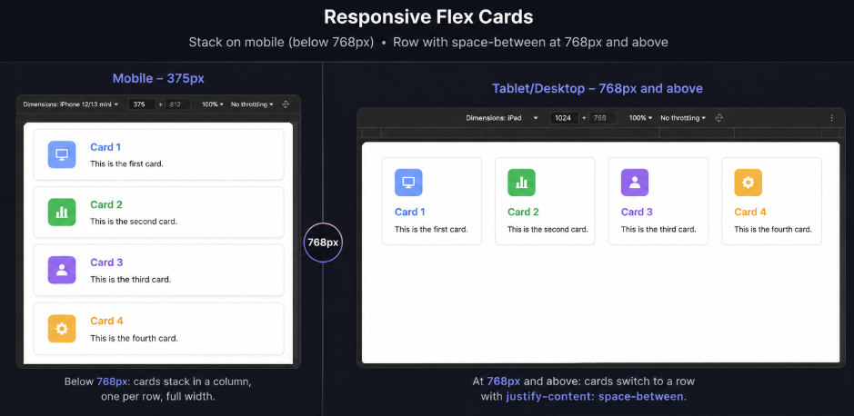

## CSS Display Property

The `display` property in CSS determines how an element is displayed on the web page. It is fundamental for controlling the layout and presentation of elements.

**Quick reference:**

| Value          | Starts on new line?  | Width                           | Accepts width/height? | Purpose                                                       |
| -------------- | -------------------- | ------------------------------- | --------------------- | ------------------------------------------------------------- |
| `block`        | ✅ yes               | full width available            | ✅ yes                | Stack sections vertically, one full-width chunk after another |
| `inline`       | ❌ no                | only as much as content needs   | ❌ no                 | Style a piece of text without breaking the flow of a sentence |
| `inline-block` | ❌ no                | only as much as content needs   | ✅ yes                | Sit inline with other elements while still controlling size   |
| `none`         | — (removed entirely) | — (takes up no space)           | —                     | Remove an element from the page and from the layout entirely  |
| `flex`         | ✅ yes (as a box)    | full width available by default | ✅ yes                | Arrange items along a single row or column, flexibly spaced   |
| `grid`         | ✅ yes (as a box)    | full width available by default | ✅ yes                | Arrange items into precise rows and columns at the same time  |

### 1. `block`

- **Description** : Elements with `display: block` start on a new line and take up the full width available by default. Block-level elements create a line break before and after themselves.

- **Common Examples** : `<div>`, `<h1>`, `<p>`, `<section>`

#### CSS:

```css
.block-element {
  display: block;
  background-color: lightblue;
  padding: 10px;
  margin-bottom: 10px;
}
```

#### HTML:

```html
<h2 class="block-element">Weekly Newsletter</h2>
<p class="block-element">
  Even though this text is short, it still stretches to fill the whole row.
</p>
<p class="block-element">
  And this one starts on its own new line right below.
</p>
```

### 2. `inline`

- **Description** : Elements with `display: inline` do not start on a new line and only take up as much width as necessary. Inline elements do not create a line break and can sit next to other inline elements.

- **Common Examples** : `<span>`, `<a>`, `<strong>`

#### CSS:

```css
.inline-element {
  display: inline;
  background-color: lightgreen;
  padding: 0 4px;
}
```

#### HTML:

```html
<p>
  Click <a href="#" class="inline-element">this link</a> to read the full
  article — notice the text keeps flowing right after it, on the same line.
</p>
```

### 3. `inline-block`

- **Description** : Elements with `display: inline-block` are formatted as inline elements but can accept block-level properties like width and height. They sit next to each other like inline elements but maintain the ability to use block properties.

- **Common Examples** : Custom elements like buttons or styled components that need block properties but inline flow.

#### CSS:

```css
.tag {
  display: inline-block;
  width: 90px;
  text-align: center;
  padding: 6px 12px;
  margin: 4px;
  border-radius: 999px;
  background-color: lightcoral;
}
```

#### HTML:

```html
<div class="tags">
  <span class="tag">HTML</span>
  <span class="tag">CSS</span>
  <span class="tag">JavaScript</span>
</div>
```

Each `.tag` sits next to the others like an inline element, but because it's `inline-block`, the fixed `width: 90px` actually applies — with plain `inline`, that width would be ignored.

### 4. `none`

- **Description** : Elements with `display: none` are completely removed from the document flow and are not displayed on the page. This is different from visibility hidden, where the element is hidden but still takes up space.

- **Common Examples** : Used for elements that should be hidden from view but not removed from the DOM, such as in toggling visibility.

#### CSS:

```css
.details {
  display: none;
}
```

#### HTML:

```html
<button onclick="document.querySelector('.details').style.display = 'block'">
  Show details
</button>
<p class="details">
  These extra details take up zero space until the button reveals them — unlike
  `visibility: hidden`, which would still leave a gap here.
</p>
```

### Conclusion

The `display` property is versatile and essential for controlling how elements appear and interact on a web page. By understanding and using different `display` values, you can create more dynamic and responsive layouts.

> ❓ The `.tag` pills earlier used `inline-block` to get a fixed `width` while still sitting side by side. Why wouldn't plain `inline` have worked there? And why not just use `block`?

## Flexbox

Flexbox arranges items along a single axis — a **row** or a **column** — and handles their spacing and alignment for you, without manual positioning.

- **Flex container**: the parent with `display: flex`.
- **Flex items**: its direct children.
- **Main axis**: the direction items line up in — horizontal for `row`, vertical for `column`.
- **Cross axis**: perpendicular to the main axis.

### Container (parent) properties

| Property          | What it does                            | Common values                                                     |
| ----------------- | --------------------------------------- | ----------------------------------------------------------------- |
| `display: flex`   | Turns the element into a flex container | —                                                                 |
| `flex-direction`  | Sets the main axis                      | `row` (default), `column`, `row-reverse`, `column-reverse`        |
| `justify-content` | Spacing along the main axis             | `flex-start` (default), `center`, `space-between`, `space-around` |
| `align-items`     | Alignment along the cross axis          | `stretch` (default), `center`, `flex-start`, `flex-end`           |
| `flex-wrap`       | Lets items wrap onto new lines          | `nowrap` (default), `wrap`                                        |

### Item (children) properties

| Property      | What it does                                                        |
| ------------- | ------------------------------------------------------------------- |
| `flex-grow`   | How much an item grows to fill leftover space, relative to siblings |
| `flex-shrink` | How much an item shrinks when there isn't enough space              |
| `flex-basis`  | The item's starting size, before grow/shrink are applied            |
| `align-self`  | Overrides `align-items` for just that one item                      |

> 💡 `justify-content` always works on the **main axis**; `align-items` always works on the **cross axis**. Flip `flex-direction` from `row` to `column` and what each property visually does flips with it.

### Example

```css
.flex-container {
  display: flex;
  flex-wrap: wrap;
  justify-content: space-around;
  align-items: center;
  background-color: lightgrey;
  padding: 10px;
}
.flex-item {
  background-color: lightseagreen;
  padding: 20px;
  margin: 10px;
  flex-grow: 1;
  flex-basis: 150px;
  text-align: center;
  color: white;
}
```

```html
<div class="flex-container">
  <div class="flex-item">Item 1</div>
  <div class="flex-item">Item 2</div>
  <div class="flex-item">Item 3</div>
  <div class="flex-item">Item 4</div>
</div>
```

### Mobile First: Column on Phone, Row on Desktop

Mobile-first means the phone layout is the default (no media query needed) — we only add a `min-width` media query to _expand_ it for bigger screens, never the reverse.

**On phone (default) — stacked in a column:**

```css
.nav-links {
  display: flex;
  flex-direction: column;
  gap: 12px;
}
```

```html
<nav class="nav-links">
  <a href="#">Home</a>
  <a href="#">About</a>
  <a href="#">Contact</a>
</nav>
```

On a narrow screen, the links stack vertically — full width, easy to tap, no horizontal squeeze.

**Extending to desktop — switch to a row above a breakpoint:**

```css
@media (min-width: 768px) {
  .nav-links {
    flex-direction: row;
    gap: 24px;
  }
}
```

Same HTML, same base rules — at 768px and above, `flex-direction` flips to `row` and the links now sit side by side.

> ❓ Why is `flex-direction` the only thing that needs to change here, and not `justify-content` or `align-items` too?

> ### 🔧 Exercise
>
> **Starter (`index.html`) — write only the CSS:**
>
> Colors: `.card-blue` `#3B82F6` · `.card-green` `#10B981` · `.card-purple` `#8B5CF6` · `.card-orange` `#F59E0B`.
>
> **Requirements:**
>
> - Phone: `.cards` is a column — one card per row, full width.
> - 768px+: `.cards` switches to a row with `justify-content: space-between` so all 4 sit side by side.
> - Verify in devtools: start at a 375px viewport, resize up, confirm the switch lands exactly at 768px.



```html
<!DOCTYPE html>
<html lang="en">
  <head>
    <meta charset="UTF-8" />
    <meta name="viewport" content="width=device-width, initial-scale=1.0" />
    <title>Responsive Cards</title>
    <link
      rel="stylesheet"
      href="https://cdnjs.cloudflare.com/ajax/libs/font-awesome/6.7.2/css/all.min.css"
    />
  </head>
  <body>
    <div class="cards-container">
      <div class="card card-blue">
        <i class="fa-solid fa-laptop-code"></i>
        <h2>Card One</h2>
        <p>This is the first card.</p>
      </div>
      <div class="card card-green">
        <i class="fa-solid fa-chart-column"></i>
        <h2>Card Two</h2>
        <p>This is the second card.</p>
      </div>
      <div class="card card-purple">
        <i class="fa-solid fa-user"></i>
        <h2>Card Three</h2>
        <p>This is the third card.</p>
      </div>
      <div class="card card-orange">
        <i class="fa-solid fa-gear"></i>
        <h2>Card Four</h2>
        <p>This is the fourth card.</p>
      </div>
    </div>
  </body>
</html>
```

## Grid

CSS Grid arranges items into rows **and** columns at the same time — unlike Flexbox, which only controls a single axis at once.

- **Grid container**: the parent with `display: grid`.
- **Grid items**: its direct children.
- **Tracks**: the rows/columns defined by `grid-template-rows`/`grid-template-columns`.

### Container (parent) properties

| Property                | What it does                             | Common values                             |
| ------------------------ | ----------------------------------------- | ------------------------------------------- |
| `display: grid`          | Turns the element into a grid container  | —                                          |
| `grid-template-columns`  | Defines the number and size of columns   | `repeat(3, 1fr)`, `200px 1fr 1fr`          |
| `grid-template-rows`     | Defines the number and size of rows      | `auto`, `100px 100px`                      |
| `gap`                    | Space between rows and columns           | e.g. `16px`                                |
| `justify-items`          | Aligns items horizontally inside their cell | `stretch` (default), `center`, `start`, `end` |
| `align-items`            | Aligns items vertically inside their cell   | `stretch` (default), `center`, `start`, `end` |

### Item (children) properties

| Property       | What it does                                  |
| --------------- | ----------------------------------------------- |
| `grid-column`   | Which column(s) an item spans, e.g. `span 2`  |
| `grid-row`      | Which row(s) an item spans                    |
| `justify-self`  | Overrides `justify-items` for just that one item |
| `align-self`    | Overrides `align-items` for just that one item  |

> 💡 `fr` means "a fraction of the remaining space" — `grid-template-columns: 1fr 1fr 1fr` always gives 3 equal columns, no matter how wide the container is.

### Example

```css
.article-grid {
  display: grid;
  grid-template-columns: repeat(3, 1fr);
  gap: 16px;
}
.article-card {
  background-color: lightgoldenrodyellow;
  padding: 20px;
  border-radius: 8px;
  text-align: center;
}
```

```html
<div class="article-grid">
  <article class="article-card">Card 1</article>
  <article class="article-card">Card 2</article>
  <article class="article-card">Card 3</article>
  <article class="article-card">Card 4</article>
  <article class="article-card">Card 5</article>
  <article class="article-card">Card 6</article>
</div>
```

Six cards snap into 3 even columns automatically, wrapping onto as many rows as needed.

### Mobile First: One Column on Phone, Multi-Column on Desktop

**On phone (default)** — a single column:

```css
.article-grid {
  display: grid;
  grid-template-columns: 1fr;
  gap: 12px;
}
```

On a narrow screen, cards stack one per row, full width.

**Extending to desktop** — more columns above a breakpoint:

```css
@media (min-width: 768px) {
  .article-grid {
    grid-template-columns: repeat(3, 1fr);
    gap: 20px;
  }
}
```

Same HTML — at 768px and above, `grid-template-columns` switches from one `1fr` column to 3 equal ones.

> ❓ In the Flexbox nav example, `flex-direction` was the one property that changed at the breakpoint. What's the one property Grid needs changed instead to go from one column to three?

### 🔧 Exercise

Reuse the same `.cards-container` starter HTML from the Flexbox exercise, but lay it out with Grid instead of Flexbox this time:

- Phone: 1 column, full width.
- 768px+: 2 columns.
- 1024px+: 4 columns, all in one row.

Resize from 375px up to 1024px+ in devtools and confirm the columns change exactly at each breakpoint.

## CSS Position Property

The `position` property in CSS specifies how an element is positioned in a document. It affects how elements are placed on the web page and can be used to create complex layouts.

### Common Values

### `static`

- **Description** : This is the default position value. Elements are positioned according to the normal document flow. Top, right, bottom, and left properties have no effect.

- **Example** :

```css
.static-element {
  position: static;
}
```

### `relative`

- **Description** : The element is positioned relative to its normal position. Setting top, right, bottom, or left will adjust the element away from its normal position.

- **Example** :

```css
.relative-element {
  position: relative;
  top: 10px;
  left: 20px;
}
```

### `absolute`

- **Description** : The element is positioned relative to its nearest positioned ancestor (an ancestor with `position` other than `static`), or the initial containing block if there are no positioned ancestors. The element is removed from the normal document flow.

- **Example** :

```css
.absolute-element {
  position: absolute;
  top: 50px;
  left: 100px;
}
```

### `fixed`

- **Description** : The element is positioned relative to the browser window, and it stays in the same place even when the page is scrolled. It is also removed from the normal document flow.

- **Example** :

```css
.fixed-element {
  position: fixed;
  top: 0;
  right: 0;
}
```

### `sticky`

- **Description** : The element toggles between `relative` and `fixed` positioning depending on the user's scroll position. It is positioned relative until a specified offset position is met in the viewport, then it "sticks" in place.

- **Example** :

```css
.sticky-element {
  position: sticky;
  top: 0;
}
```

### Example

#### CSS:

```css
.container {
  height: 200px;
  position: relative;
  background-color: lightgrey;
}

.relative-element {
  position: relative;
  top: 20px;
  left: 20px;
  background-color: lightblue;
  padding: 10px;
}

.absolute-element {
  position: absolute;
  top: 50px;
  left: 50px;
  background-color: lightgreen;
  padding: 10px;
}

.fixed-element {
  position: fixed;
  top: 10px;
  right: 10px;
  background-color: lightcoral;
  padding: 10px;
}

.sticky-element {
  position: sticky;
  top: 0;
  background-color: lightgoldenrodyellow;
  padding: 10px;
}
```

#### HTML:

```html
<!DOCTYPE html>
<html lang="en">
  <head>
    <meta charset="UTF-8" />
    <meta name="viewport" content="width=device-width, initial-scale=1.0" />
    <title>Position Property Example</title>
    <style>
      .container {
        height: 200px;
        position: relative;
        background-color: lightgrey;
      }

      .relative-element {
        position: relative;
        top: 20px;
        left: 20px;
        background-color: lightblue;
        padding: 10px;
      }

      .absolute-element {
        position: absolute;
        top: 50px;
        left: 50px;
        background-color: lightgreen;
        padding: 10px;
      }

      .fixed-element {
        position: fixed;
        top: 10px;
        right: 10px;
        background-color: lightcoral;
        padding: 10px;
      }

      .sticky-element {
        position: sticky;
        top: 0;
        background-color: lightgoldenrodyellow;
        padding: 10px;
      }
    </style>
  </head>
  <body>
    <div class="container">
      <div class="relative-element">Relative Element</div>
      <div class="absolute-element">Absolute Element</div>
      <div class="sticky-element">Sticky Element</div>
    </div>
    <div class="fixed-element">Fixed Element</div>
    <p>Scroll down to see the sticky element in action.</p>
    <div style="height: 1000px;"></div>
  </body>
</html>
```

---
