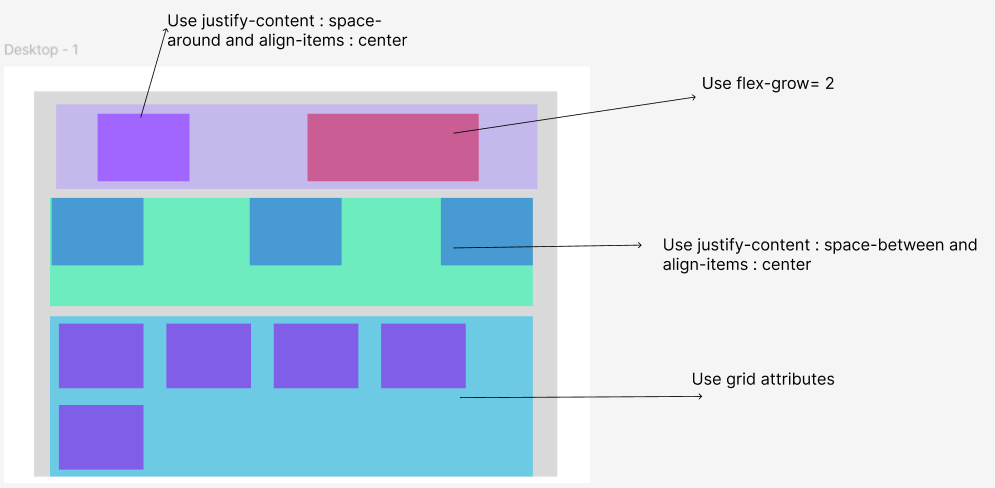

## Part 1

### Tasks:
  **Recreate the given UI layout using HTML and CSS, incorporating flexbox and grid attributes as annotated in the provided design.**

#### Section 1 (Top Section - Two Blocks):

Use flexbox for layout.
Set justify-content: space-around and align-items: center.
The second (right) block should have flex-grow: 2 to make it expand more than the first block.

#### Section 2 (Middle Section - Three Blocks):

Use Flexbox.
Apply justify-content: space-between and align-items: center to distribute the three blocks with space between them.

#### Section 3 (Bottom Section - Grid Layout):

Use CSS Grid to organize five blocks.
Make sure the grid layout is responsive and visually balanced.

### Implementation Details:
Create a container element for each section.
Use distinct background colors for each div
Add appropriate spacing and padding to mimic the visual structure.
You may add labels or borders to help visually separate blocks if needed.

### Files:
index.html
styles.css

### Refrence Image:

##  Part 2

### It is finally time to stylize the Home Page:

Follow the guidelines in design.pdf to style the home page. Apply the required CSS to match the specified design using what you have learned.

[Design Picture](https://github.com/svs-ong/web-intership-homework/blob/main/design.pdf)

