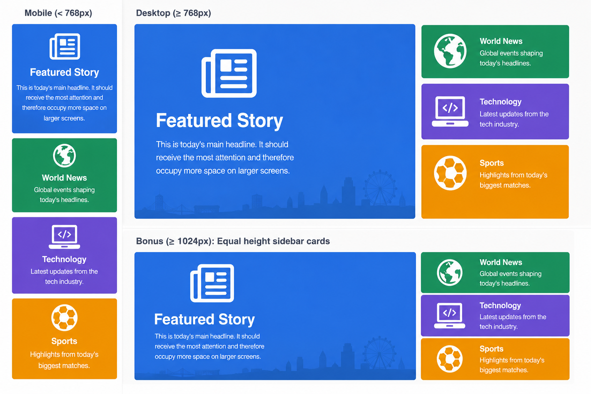

# Practice

## Starter

> 🔧 Exercise: Responsive News Homepage, with `Stack`
>
> Colors: `Featured Story` `#3B82F6` · `World News` `#10B981` · `Technology` `#8B5CF6` · `Sports` `#F59E0B`.
>
> **Starter (`NewsHomePage.tsx`) — write only the props, all the content is already here:**
> **Requirements:**
>
> - Wrap the whole thing in a `Container` from `@mui/material` instead of returning the outer `Stack` directly.
> - Phone (default): the outer `Stack` has `direction="column"` — `Featured Story` first, full width, then the 3 news cards underneath, also full width.
> - `md` (900px) and up: the outer `Stack` switches to a row — MUI's `direction` prop accepts a **responsive object**, `{ xs: "column", md: "row" }`, so this needs no separate media query at all.
> - Give the `Featured Story` `Paper` `sx={{ flex: 2 }}` and the sidebar `Stack` `sx={{ flex: 1 }}`, so the featured story stays about twice as wide as the sidebar at any window width — `Stack` children still take plain flex properties through `sx`.
> - The sidebar `Stack` needs its own `direction="column"` — it's a nested flex container stacking its 3 cards, completely independent of the outer `Stack`'s current direction.
> - Use `spacing` on both `Stack`s for the gaps instead of manual margins — remember MUI's default spacing unit is `8px`, so pick the value that reproduces the `20px` gap from the original exercise.
> - Add each card's background color with `sx={{ bgcolor: ... }}` on the matching `Paper`, plus `color: "white"`, `p: 3` and `textAlign: "center"` so the content isn't jammed against the edges.
> - Give every icon `fontSize="large"` so it's noticeably bigger than the heading beneath it.
>
> **Verify:**
>
> - Below 900px: one column — Featured, then the 3 news cards stacked underneath, everything full width.
> - At 900px+: two columns side by side; Featured stays ~2× the width of the sidebar no matter how far you keep widening.
> - At every width, the 3 cards inside the sidebar stay stacked vertically.
> - Widen the browser to a very large screen (1600px+) and compare with and without the `Container` — temporarily remove it and reload. Without it, the row stretches edge-to-edge with the window; with it, the content stops growing past `Container`'s max width and stays centered, with empty space on either side.

```ts
import { Stack, Paper, Typography } from "@mui/material";
import NewspaperIcon from "@mui/icons-material/Newspaper";
import PublicIcon from "@mui/icons-material/Public";
import LaptopMacIcon from "@mui/icons-material/LaptopMac";
import SportsSoccerIcon from "@mui/icons-material/SportsSoccer";

export const NewsHomePage = () => {
  return (
    <Stack>
      <Paper>
        <NewspaperIcon />
        <Typography variant="h2">Featured Story</Typography>
        <Typography>
          This is today's main headline. It should receive the most attention
          and therefore occupy more space on larger screens.
        </Typography>
      </Paper>


      <Paper>
        <PublicIcon />
        <Typography variant="h3">World News</Typography>
        <Typography>Global events shaping today's headlines.</Typography>
      </Paper>

      <Paper>
        <LaptopMacIcon />
        <Typography variant="h3">Technology</Typography>
        <Typography>Latest updates from the tech industry.</Typography>
      </Paper>

      <Paper>
        <SportsSoccerIcon />
        <Typography variant="h3">Sports</Typography>
        <Typography>Highlights from today's biggest matches.</Typography>
      </Paper>
    </Stack>
  );
};
```

> 💡 `Container` doesn't do any flex/row/column work itself — it just caps how wide its content is allowed to get (`maxWidth="lg"` by default, 1200px) and centers it with automatic side margins. It's solving a different problem than `Stack`: `Stack` arranges the children, `Container` limits how far that whole arrangement is allowed to stretch.



---

## Team Work

Same shared project — this is where it gets finished. Take the page/component split from the React Intro course and turn it into the real thing: fully styled with MUI, matching `design.pdf`, mobile and desktop.

- **Build a `theme.ts`** with `createTheme()` — `palette` for the cream background and navy accent color from `design.pdf`, `typography` for the serif display font on headings.
- **Wrap the app once**, in `main.tsx`/`App.tsx`, with `<ThemeProvider theme={theme}>` and `<CssBaseline />` — every page picks up the theme from there, nothing set up per page.
- **Style through the theme, not through `sx` repeated everywhere.** For any component you use more than once — buttons, the category pills, article cards — add a `components.MuiX.styleOverrides.root` entry in `theme.ts` instead of pasting the same `sx` object on every instance. One definition, used everywhere that component appears.
- **Remove all raw HTML and CSS.** No `.css` files anywhere in the app, and no `<div>`, ``, `<h1>`–`<h6>`, `<p>`, `<button>`, `<a>`, `<input>`, or `<form>` either — every one of those becomes its MUI equivalent instead (`Box`, `Card`/`CardMedia`, `Typography`, `Button`, `Link`, `TextField`, `Chip` for the category pills and tags, ...).
- **Finish every page** — Home, About, Contact, Article — mobile and desktop, matching `design.pdf`. The header/nav, the search bar, the article grid, the contact form: all of it, all MUI, all styled through the theme.

> 💡 If you catch yourself writing the same `sx={{ ... }}` on every `Button` or every `Chip`, that's the sign it belongs in `theme.ts`'s `components` section instead of on the component itself.

<div style="height:200px"></div>
